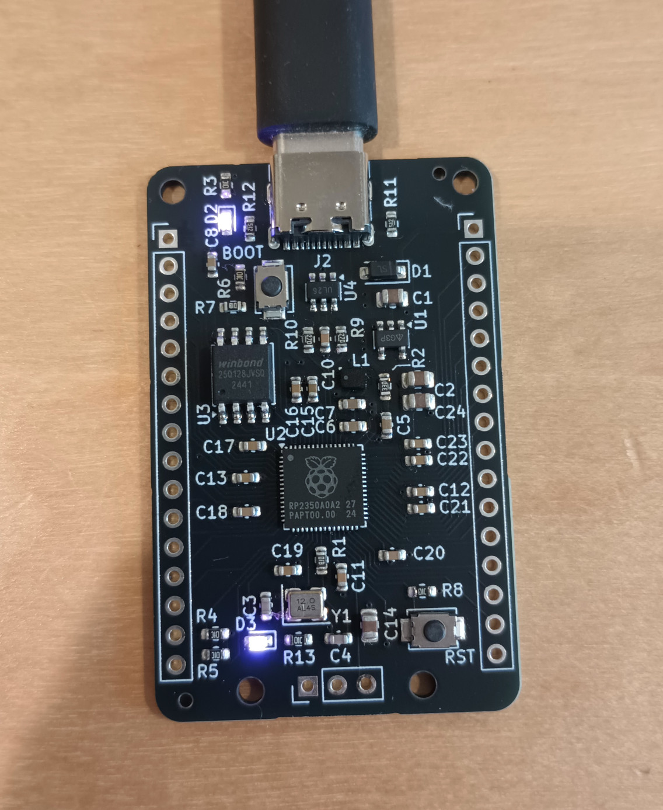

# rp2350a-board
A simple development board featuring the rp2350a microcontroller.

## Changes from the Pico 2

- PICO_DEFAULT_LED_PIN is now IO15
- Flash size increased to 128Mbit
- ESD protection on the usb data wires
- A reset button
- An LDO voltage regulator
- USB-C receptacle

`blink` and `hello_usb` of the examples worked on the board as expected.

Licensed under CERN-OHL-P v2 or later
